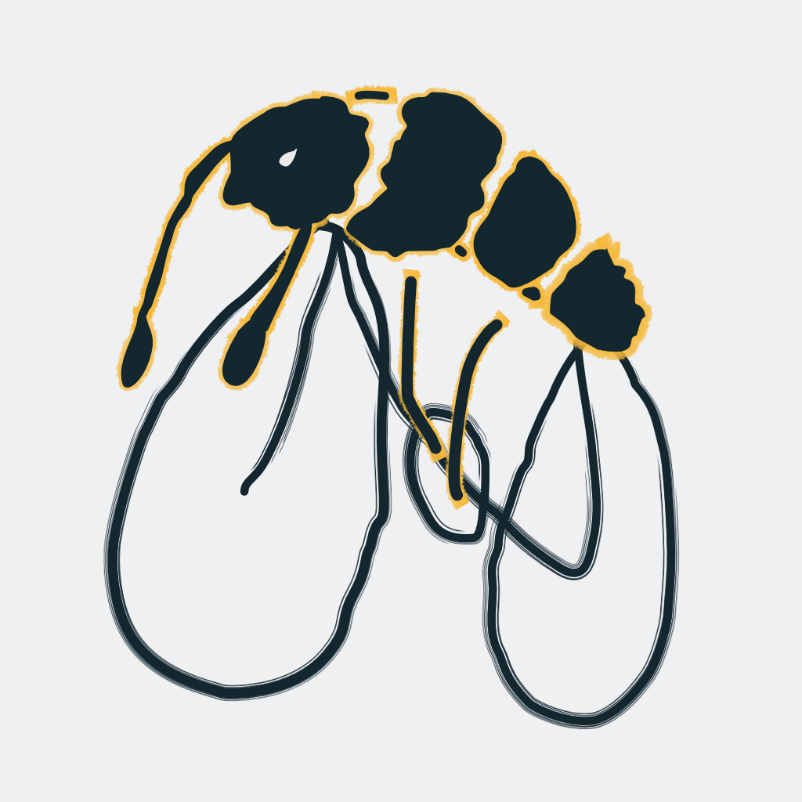

<p align="left">
  
</p>

# beebeebike

beebeebike is a cycling-oriented Berlin routing app. I like thinking about map ux and this is an experiment where I wondered: what if you could just draw on the map where you love and hate to cycle? 

The app uses those personal ratings when calculating routes, so your trips can bend toward your favorite segments and away from the ones you would rather never see again. It is a Svelte frontend, Rust/Axum backend, PostgreSQL/PostGIS database, MapLibre map, and GraphHopper routing stack.

## Quickstart

You will need Docker and Docker Compose. The local stack expects Berlin OSM and tile data under `data/`; the helper scripts in `scripts/` are there to fetch those.

```sh
brew install just   # one-time
just setup
just dev
```

Then open the app at `http://localhost:5173`.

## Mobile app (iOS)

Flutter client in `mobile/`. Requires the `ferrostar_flutter` plugin at `packages/ferrostar_flutter/`.

```bash
just setup-mobile
just dev-ios-sim  # runs against https://beebeebike.com by default; override with BEEBEEBIKE_API_BASE_URL + BEEBEEBIKE_TILE_SERVER_BASE_URL
```

> Android support is planned for a future release.

## Deployment notes

The rating overlay uses Server-Sent Events on `/api/ratings/events` to push paint changes to connected clients. Any reverse proxy in front of the backend must disable response buffering and caching on that path, keep the upstream `Connection` header empty, and set a long read timeout (hours, not seconds). Without those settings nginx (and most other proxies) will buffer the stream until the timeout fires, so clients see an open socket that never delivers any events. Local dev hits the backend directly and is not affected.

## Contributing

Contributions are welcome. Please open an issue first so we can talk through the idea, the shape of the change, and any bike-brain edge cases before you start building.
